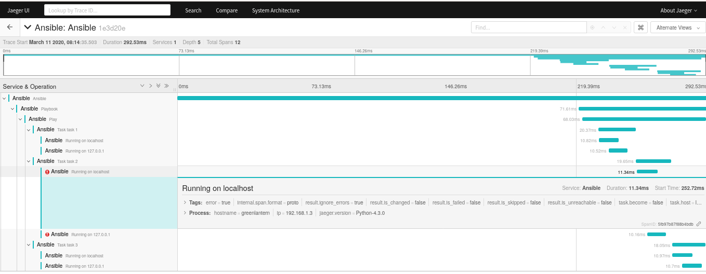

# OpenTracing for Ansible

## Installation

1. Create the directory `callbacks` in your ansible root directory.
2. Edit the ansible.cfg to contain this:
```
[defaults]
callback_plugins= ./callbacks
callback_whitelist = aot
```
3. Run Jaeger. Docker is recommended:
```
docker run -d --name jaeger \
  -p 5775:5775/udp \
  -p 16686:16686 \
  jaegertracing/all-in-one:1.13
```
4. Install opentracing and jaeger-client for python:
```
pip install opentracing jaeger-client
```
5. Download the file `aot.py` into the `callbacks` directory:
```
curl https://raw.githubusercontent.com/magmax/ansible-opentracing/master/aot.py \
  -o callbacks/aot.py
```
6. Run ansible as usual
7. See the results at http://localhost:16686/search?service=Ansible


Example:



# Configuration

Configuration is possible by environment variables:

===================  ===============  ============
Variable             Default          Description
===================  ===============  ============
*AOT_LOGGING*        Undefined        Enable stdout output. Useful for debugging Ansible OpenTracing. 
*AOT_SAMPLER_RATE*   1                Percentage of samples to be sent to the server.
*AOT_JAEGER_HOST*    localhost        Jaeger server address.
*AOT_JAEGER_PORT*    5775             Jaeger server UDP port.
===================  ===============  ============
